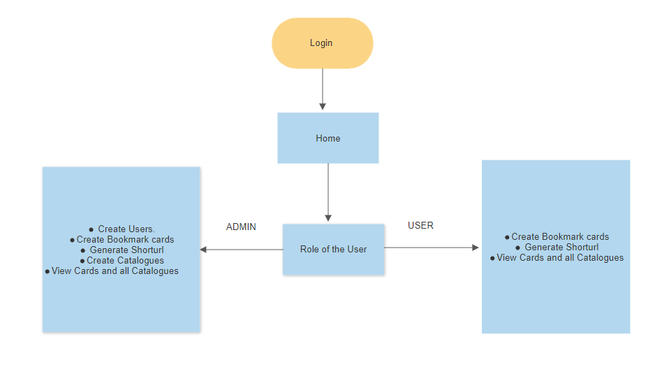
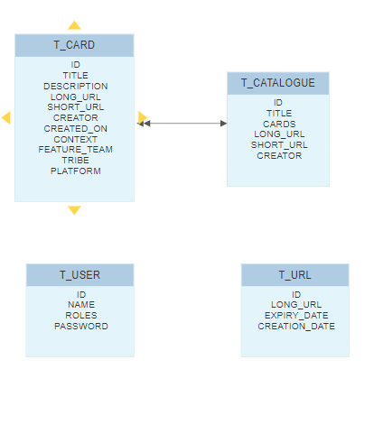

# Bookmark and url shortening

> One place to get all the bookmarks and generate short urls.

## Functionalities
- <medium> Generate short urls and share</medium>
- <medium> Create bookmark cards for later use</medium>
- <medium> Users with admin privilage able to create new users with role as ADMIN / USER</medium>
- <medium> Admin can create catalogue of cards based on Feature team or Tribe or Platform</medium>
- <medium> All users able to view those catalogues </medium>
- <medium> All user can share a short url of each catalogue</medium>

## Technical stack

> [Github Organisation](https://github.com/Enigineering-Stream-Hackathon)

**Backend**
- <medium> Language: Java 8</medium>
- <medium> Framework: Spring, spring-boot, spring-cloud</medium>

**Frontend**
- <medium> Language: JavaScript</medium>
- <medium> Framework: (P)React</medium>

**Database**
- <medium> Inmemory: h2</medium>

**CI\CD**
- <medium> Job runner: [Circle CI Project](https://app.circleci.com/pipelines/github/Enigineering-Stream-Hackathon)</medium>
- <medium> Coverage report: [Codecov Project](https://codecov.io/gh/Enigineering-Stream-Hackathon/)</medium>
- <medium> Quality report: [Codacy Project](https://app.codacy.com/organizations/gh/Enigineering-Stream-Hackathon/repositories?accessUri=/organizations/gh/Enigineering-Stream-Hackathon/repositories)</medium>
- <medium> Cloud server: [Heroku Project](https://dashboard.heroku.com/apps)</medium>
> [Google Style Guide](https://github.com/google/styleguide/blob/gh-pages/intellij-java-google-style.xml)

## How to start the applications in local?

- <medium>user-management and bookmark-catalogue services</medium>
    - <medium>Check out the service from the git</medium>
    - <medium>Start the main application</medium>

- <medium>bookmark-catalogue-web</medium>
    - <medium>Check out the service from the git</medium>
    - <medium>Update the constant.js file with the localhost urls of the 3 service</medium>
    - <medium>From terminal run the command `npm start`</medium>

## Quick Look

[BookMark Catalogue](https://bookmark-catalogue-web.herokuapp.com/)
- > default user with ADMIN role 'admin'
- >  default user with ADMIN role 'user'

## System design

**Identification of ROLE between USER and ADMIN**
    

**Database design**

## Repositories

**User Management**
- <small>User management is a hexagonal service helps in managing users. Create and Find of users are the two main functionalities of this service</small>
- > <medium>Repository : [user-management](https://github.com/Enigineering-Stream-Hackathon/user-management)<medium>
- > <medium>Swagger : [swagger](https://user-management-bs.herokuapp.com/swagger-ui/index.html?url=/v3/api-docs#/)<medium>
- > <medium>Use Cases : [BDD](https://github.com/Enigineering-Stream-Hackathon/user-management/tree/master/domain/src/test/resources/features)<medium>
- > <medium> Code Quality : <medium>
    
**Bookmark catalogue**
- <small>Bookmark Catalogue service enables following scenarios:</small>
    - <small>Enables user to generate short url with expiry date</small>
    - <small>Enables users to create and view bookmark cards</small>
    - <small>Enables admins to create catalogue</small>
    - <small>Enables users to share the short urls of the catalogue</small>
 
- > <medium>Repository : [bookmark-catalogue](https://github.com/Enigineering-Stream-Hackathon/bookmark-catalogue)<medium>
- > <medium>Swagger : [swagger](https://bookmark-catalogue.herokuapp.com/swagger-ui/index.html?url=/v3/api-docs#/)<medium>
- > <medium>Use Cases : [BDD](https://github.com/Enigineering-Stream-Hackathon/bookmark-catalogue/tree/master/domain/src/test/resources/features)<medium>
- > <medium> Code Quality : <medium>

**Bookmark catalogue web**
- <small>Bookmark Catalogue service enables following scenarios:</small>
    - <small>Enables user to login with username and perform actions based on role</small>
    - <small>Enables user to generate short url with expiry date</small>
    - <small>Enables users to create and view bookmark cards</small>
    - <small>Enables admins to create catalogue</small>
    - <small>Enables users to share the short urls of the catalogue</small>
 
- > <medium>Repository : [bookmark-catalogue-web](https://github.com/Enigineering-Stream-Hackathon/bookmark-catalogue-web)<medium>
- > <medium> Code Quality : <medium>

## Future Scope

- <small>Enables user to edit details and add password for login</small>
- <small>Verify login and continue</small>
- <small>More user friendly UI design</small>
- <small>Add details like Feature team, tribe, platform details in the cards</small>
- <small>Add description for catalogues</small>

## Open Bugs

- <small>On click of card in catalogue, open a new window with the card short url redirection to actual one</small>